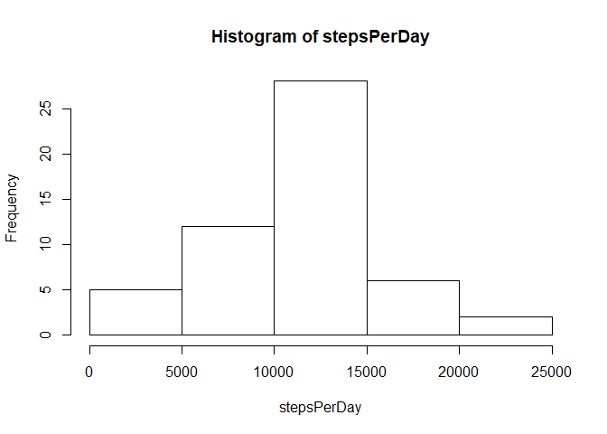
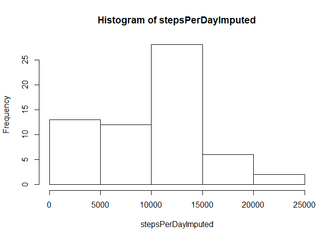
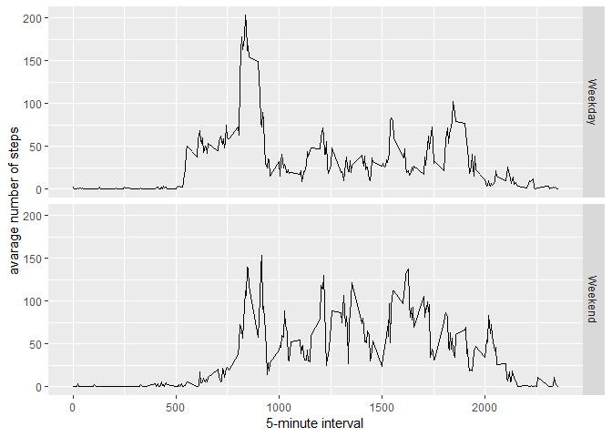

## Loading and preprocessing the data

####Loading the needed libraries


```r
library(ggplot2)
```

```
## Warning: package 'ggplot2' was built under R version 3.5.2
```

```r
library(plyr)
```

```
## Warning: package 'plyr' was built under R version 3.5.2
```

```r
library(Hmisc)
```

```
## Warning: package 'Hmisc' was built under R version 3.5.2
```

```
## Loading required package: lattice
```

```
## Loading required package: survival
```

```
## Loading required package: Formula
```

```
## Warning: package 'Formula' was built under R version 3.5.2
```

```
## 
## Attaching package: 'Hmisc'
```

```
## The following objects are masked from 'package:plyr':
## 
##     is.discrete, summarize
```

```
## The following objects are masked from 'package:base':
## 
##     format.pval, units
```

```r
library(lattice)
```

####Loading and preprocessing the data


```r
activity <- read.csv("r/activity.csv")
head(activity)
```

```
##   steps       date interval
## 1    NA 2012-10-01        0
## 2    NA 2012-10-01        5
## 3    NA 2012-10-01       10
## 4    NA 2012-10-01       15
## 5    NA 2012-10-01       20
## 6    NA 2012-10-01       25
```

```r
activity$day <- weekdays(as.Date(activity$date))
activity$date<- as.POSIXct(activity$date, format="%Y-%m-%d")
head(activity)
```

```
##   steps       date interval    day
## 1    NA 2012-10-01        0 Monday
## 2    NA 2012-10-01        5 Monday
## 3    NA 2012-10-01       10 Monday
## 4    NA 2012-10-01       15 Monday
## 5    NA 2012-10-01       20 Monday
## 6    NA 2012-10-01       25 Monday
```

```r
str(activity)
```

```
## 'data.frame':	17568 obs. of  4 variables:
##  $ steps   : int  NA NA NA NA NA NA NA NA NA NA ...
##  $ date    : POSIXct, format: "2012-10-01" "2012-10-01" ...
##  $ interval: int  0 5 10 15 20 25 30 35 40 45 ...
##  $ day     : chr  "Monday" "Monday" "Monday" "Monday" ...
```

## What is mean total number of steps taken per day?

#### Total number of steps taken per day


```r
stepsPerDay <- tapply(activity$steps, activity$date, sum)


head(stepsPerDay)
```

```
## 2012-10-01 2012-10-02 2012-10-03 2012-10-04 2012-10-05 2012-10-06 
##         NA        126      11352      12116      13294      15420
```

#### Histogram of the total number of steps taken each day


```r
hist(stepsPerDay)
```

<!-- -->


```r
stepsPerDayMean <- mean(stepsPerDay, na.rm = TRUE)
stepsPerDayMedian <- median(stepsPerDay, na.rm = TRUE)
```

* Mean steps per Day: 1.0766189\times 10^{4}
* Median steps per Day:  10765


## What is the average daily activity pattern?

#### removing the NAs


```r
clean <- activity[!is.na(activity$steps),]
```

#### Create average number of steps per interval

```r
intervalTable <- ddply(clean, ~ interval, plyr::summarize, Avg = mean(steps))
```

#### Create line plot of average number of steps per interval

```r
ggplot(intervalTable, aes(x=interval, y=Avg)) +
  geom_line()+xlab("Interval") +
  ylab("Average Number of Steps") + 
  ggtitle("Average Number of Steps per Interval")
```

<!-- -->

## Which 5-minute interval, on average across all the days in the dataset, contains the maximum number of steps?

####Maximum steps by interval

```r
maxSteps <- max(intervalTable$Avg)
```

####Which interval contains the maximum average number of steps

```r
intervalTable[intervalTable$Avg==maxSteps,1]
```

```
## [1] 835
```

The 5-minute interval which had the maximum number of steps was the 
835 interval.


#### Total number of missing values in the dataset : 2304

```r
nrow(activity[is.na(activity$steps),])
```

```
## [1] 2304
```

## Imputing missing values

####Create a new dataset that is equal to the original dataset but with the missing data filled in

```r
activityImputed <- activity
activityImputed$steps <- impute(activity$steps)  
```
#### I use the median value across the entire dataset as the imputed value (default)
#### I did not mean as the imputed value as imputing with mean will result in no change in the mean value before and after imputing 

#### CHeck that number of NAs = 0 now

```r
nrow(activityImputed[is.na(activityImputed$steps),])
```

```
## [1] 0
```

#### Create histogram

```r
stepsPerDayImputed <- tapply(activityImputed$steps, activityImputed$date, sum)

hist(stepsPerDayImputed)
```

<!-- -->

```r
head(stepsPerDayImputed)
```

```
## 2012-10-01 2012-10-02 2012-10-03 2012-10-04 2012-10-05 2012-10-06 
##          0        126      11352      12116      13294      15420
```

#### Calculate and report the mean and median total number of steps taken per day


```r
stepsPerDayMeanImputed <- mean(stepsPerDayImputed)
stepsPerDayMedianImputed <- median(stepsPerDayImputed)
```

* Mean steps per Day (imputed): 9354.2295082
* Median steps per Day (imputed):  1.0395\times 10^{4}

#### What is the impact of imputing missing data on the estimates of the total daily number of steps?
#### Ans : The mean and median steps after imputation is lower compared to the respective values without imputation


## Are there differences in activity patterns between weekdays and weekends?

#### Create new category based on the days of the week

```r
activityImputed$DayCategory <- ifelse(activityImputed$day %in% c("Saturday", "Sunday"), "Weekend", "Weekday")
```


```r
intervalTable2 <- aggregate(steps ~ interval + DayCategory, data=activityImputed, mean)

ggplot(intervalTable2, aes(interval, steps)) + 
  geom_line() + 
  facet_grid(DayCategory ~ .) +
  xlab("5-minute interval") + 
  ylab("avarage number of steps")
```

<!-- -->

#### Yes, there are differences

####the activity is more uniform / consistent across time intervals during weekends
####For weekdays, there is a larger range of steps. A possible explanation is working over the weekdays and there are defined periods on the job where higher activity is expected
